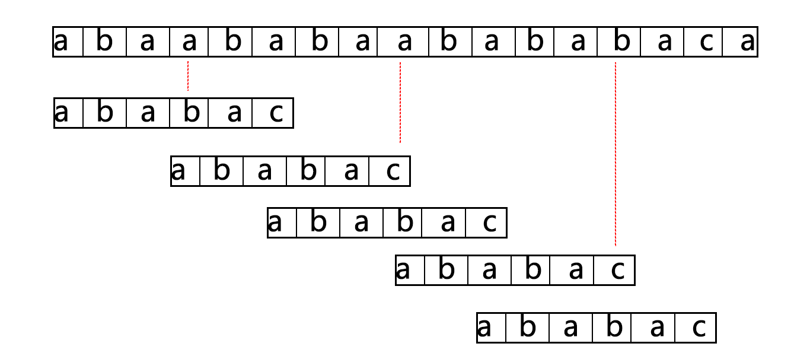
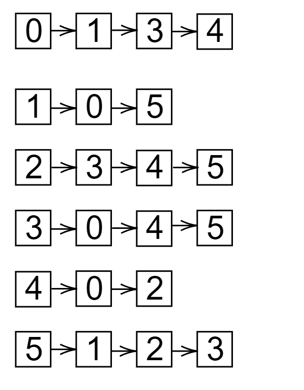
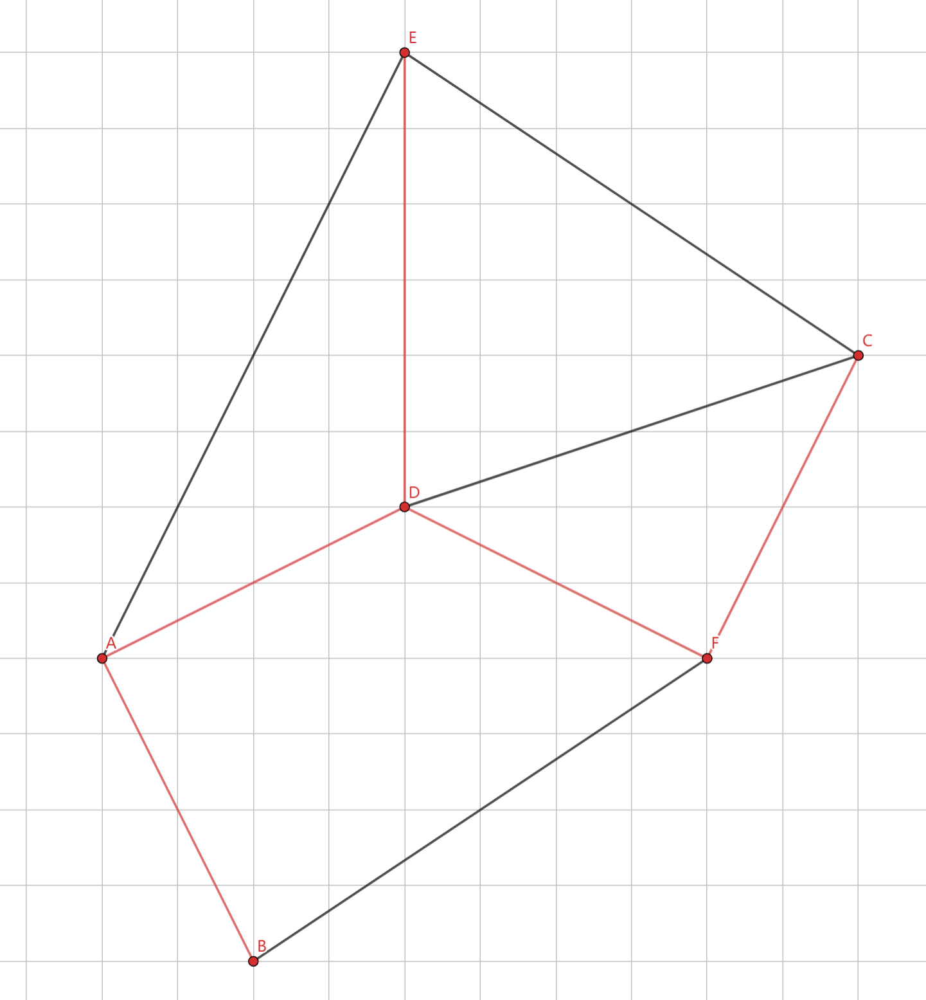
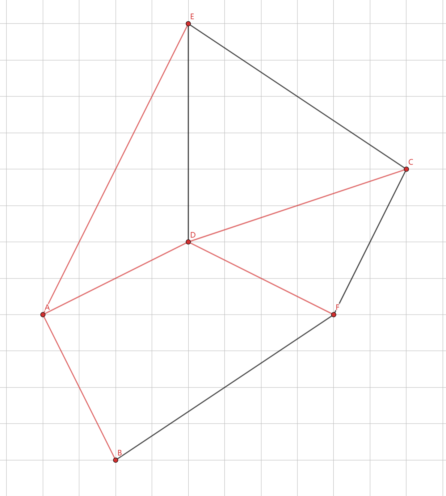

# 第二次作业
#### 第一题
```cpp
    template <class ElemType>
    void CyQueue<ElemType>::EnQueue(CyQueue &Q, ElemType x) {
        if (flag && rear == front)
            cout << "Queue Full!!" << endl;
        Q.queue[rear] = x;
        rear = (rear + 1) % MaxSize;
        if (!flag)
            flag = 1;
    }
    template <class ElemType> ElemType CyQueue<ElemType>::OutQueue(CyQueue &Q) {
        if (!flag)
            cout << "Queue Empty!!" << endl;
        ElemType e = array[front];
        front = (front + 1) % Q.MaxSize;
        if (front == rear)
            flag = 0;
        return e;
    }

```
#### 第二题
**(1)**
```cpp
    For(int i = 0; i < halfSize; i++) Push(s,Deque(q));


    While(!isEmptyStack(s)) {
        EnQueue(q,Pop(s));
        EnQueue(q,DeQue(q));

    }
```
**(2)**
```cpp
    void reverseQueueFirstKElements(int k, struct Queue *q) {
        if (q == NULL || k > size(q))
            return;
        else if (k > 0) {
            struct Stack *s = CreateStack();
            for (int i = 0; i < k; i++)
                Push(s, DeQueue(q));
            while(!isEmptyStack(s)) EnQueue(q, Pop(s));
            EnQueue(q, DeQue(q));
        }
    }
```
#### 第三题
```cpp
void next(char *P, int N[]) {
    int m = strlen(P);
    N[0] = 0;
    int i = 1, j = 0;
    while (i < m) {
        if (P[i] == P[j]) {
            N[i] = j + 1;
            i++;
            j++;
        } else if (j > 0)
            j = N[j - 1];
        else {
            N[i++] = 0;
        }
    }
}
```

**比较了22次**
#### 第四题
$n=\sum_{i=1}^h{k^{i-1}}=\frac{k^h-1}{k-1}$
叶子节点数为$k^h=n(k-1)+1$

#### 第五题
(1)
$$
2^{h-1}-1<500 \\
2^h-1\geq 500 \\
\Rightarrow h=9
$$
(2) 
$$
500-(2^{h-1}-1)=245个
$$
(3)
$$
2^{h-1}-1-(2^{h-1}-245)=244个
$$
#### 第六题
```cpp
int BinaryTree::FindMax(TNODE *root) {
    int root_val, left, right, max = INT_MIN;
    if (root != NULL) {
        root_val = root.value;
        left = FindMax(root.left);
        right = FindMax(root.right);
        max = max(left, right, root_val);
    }
    return max
}
```
**时间复杂度：**$O(n)$**空间复杂度：**$O(n)$
#### 第七题
```cpp
int BinaryTree::FindLevelwithMaxSum(BinaryTree *root) {
    TNODE *temp;
    int level = 0, maxLevel = 0;
    struct Queue Q;
    int currentSum = 0, maxSum = 0;
    if (!root)
        return 0;
    InitQueue(Q);
    EnQueue(Q, root);
    while (!Q.isEmpty()) {
        int size = Q.size();
        while (size-- > 0) {
            temp = DeQueue(Q);
            currentSum += temp.value;

            if (temp.left)
                EnQueue(Q, temp.left);
            if (temp.right)
                EnQueue(Q, temp.right);
        }
        if (maxSum < currentSum)
            maxSum = currentSum;
        currentSum = 0;
    }
    return maxSum;
}
```
**时间复杂度：**$O(n)$**空间复杂度：**$O(n)$
#### 第八题
**上界:** 当`E`条边全部集中在一个连通分支时连通分量最大，当该分支为完全图时有最少个点
$$E=\frac{n(n-1)}{2}\Rightarrow n\geq \lceil \frac{1+\sqrt{1+8E}}{2}\rceil\\
因此连通分量为V-\lceil \frac{1+\sqrt{1+8E}}{2}\rceil+1$$
**下界:** 
$$
\begin{cases}
当E\geq V-1时，下界为1\\
当E\lt V-1时，下界为V-E
\end{cases}
$$

#### 第九题
**入度：**$\sum\limits_{k=0}^{n-1}A[k][i]$
**出度：**$\sum\limits_{k=0}^{n-1}A[i][k]$
**度：**$\sum\limits_{k=0}^{n-1}(A[k][i]+A[i][k])$
#### 第十题
**(1)**

**(2)**
**Prim**
**顺序：** 3-5,0-3,0-1,2-5,3-4

**Kruskal**
**顺序：** 3-5,0-3,0-1,2-5,3-4

**(3)**
*以A点作为源点*


#### 第十一题
```cpp
Graph *ReverseTheDirectedGraph(Graph *G) {
    Graph *Gr;
    if (G == NULL) {
        Gr = NULL;
        return NULL;
    }
    Initialize(Gr, Vcnt(G), NULL);
    int n = Vcnt(G);
    for (int i = 0; i < n; i++) {
        for (int j = 0; j < n; j++) {
            if (G->edge(i, j))
                Gr->insert(j, i);
        }
    }
}
```