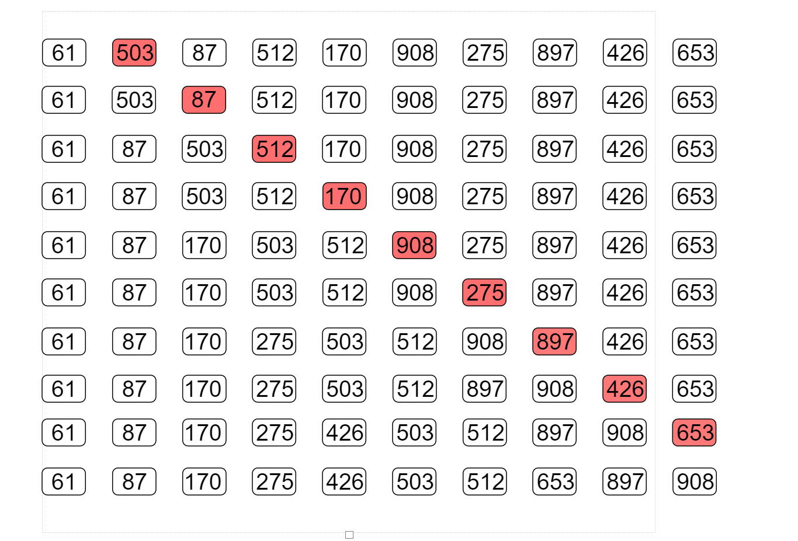

<!--
 * @Descripttion: 
 * @version: 
 * @Author: Mao Shunyu
 * @Date: 2022-12-01 14:03:03
 * @LastEditors: Do not edit
 * @LastEditTime: 2022-12-01 15:26:31
-->
# 第三次书面作业
### 1.

### 2.

折半查找树也是一种二叉搜索树，满足二叉搜索树的性质，但是折半查找树的根节点是所有节点的中间值，并且每一个元素都是某一个区间上的中间值。

### 3.

### 4.
插入排序

快速排序
